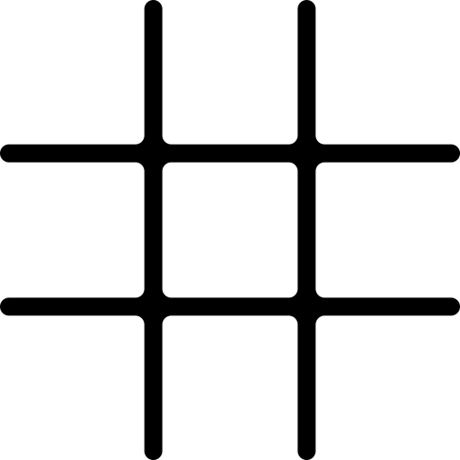



# Zenject

Регистрация скриптов происходит в [DependencyInstaller](./Assets/Scripts/injections/DependencyInstaller.cs).

### Game Manager

Скрипт [GameManager](./Assets/Scripts/general/GameManager.cs) является основным узлом бизнес-логики в проекте, и
инстанциируется через
[DependencyInstaller](./Assets/Scripts/injections/DependencyInstaller.cs) как синглтон. Скрипт наследуется от интерфейса
[IGameManager](./Assets/Scripts/general/IGameManager.cs), в котором реализованы следующие методы и поля:

#### Поля-события

* OnClick;
* OnGameEndCross;
* OnShowPanel;
* OnRestart;

#### Методы

* Restart;
* Touch;
* TrySelectCell;

#### Поля конкретной реализации интерфейса

    private Dictionary<int2, CellState> _cellStates = new(); - хранит в себе состояние ячеек поля (не выбрана, X или O) по координате
    private bool _turnO; - текущий ход игрока X или O
    private readonly Sprite _xImg; - Спрайт X
    private readonly Sprite _oImg; - Спрайт O
    private readonly WinConditionBase _winCheck; - Логика проверки условий победы
    private bool _lock; - общий блокировщик нажатия кнопок

    private WinState _winState; - текущее состояние игры
    private readonly IEndMsgProcessor _message; - Логика отображения сообщения о победе
    private readonly ISaveSys _saveSys; - Логика сохранений

В конструкторе класса подгружаются спрайты для выбранных клеток (_xImg и _oImg), через паттерн Command присваивается
логика [проверки условий победы](#Победа), [логика сообщения](#Логика-сообщений) и [система сохранений](
#Сохранение прогресса). Все методы логики передаются через Zenject. После присваивания логики выполняется
метод [TryRestoreField()](#TryRestoreField) для восстановления событий прошлой сессии.

#### TryRestoreField

Логика сохранений возвращает кортеж, содержащий состояние поля игры и текущего игрока. Данные приваиваются
соотвествующим полям.

#### TrySelectCell

Обработчик события нажатия на кнопку ячейки на поле, который вызывается в [ActionButton](#ActionButton).

Если поднят флаг блокировщика (_lock), срабатывает прерывание. Если поднят флаг окончания игры (_winState.GameFinished),
срабатывает прерывание. Далее производится проверка, была ли кнопка уже нажата - занята ли клетка. Если да - прерывание.

Если прерывания не сработало, то состоянию ячейки на поле присваевается состояние, полученное из метода
CellStateByPlayer. Вызывается событие OnClick, в которое передается кортеж из спрайта и его цвета через метод GetClrImg,
а так же координата ячейки.

Далее производится проверка условий победы
через [WinConditionBase.Handle()](./Assets/Scripts/general/win/condition/WinConditionBase.cs) (
см. [Логика победы](#Логика-победы)), куда передаются

* текущее состояние ячейки;
* координаты;
* ячейки, отмеченные текущим игроком
* количество заполненых на данный момент ячеек
* закончена ли игра.

Если состояние игры

    _winState.GameFinished == true;

то срабатывает событие OnGameEndCross, куда передается [тип линии](#Зачеркивание-результата), начальная координата для
построения, и хэндлер [EndGameLogic](#EndGameLogic) в случае, если не было ничьей. В противном случае вместо события
OnGameEndCross вызвается просто EndGameLogic; Выполнение кода прерывается.

Если игра ещё не окончена, то ход передается другому игроку и состояние поля сохраняется через _saveSys.SaveFieldState.
Сохранение поля после проверки на окончание гры сделано для того, чтобы после перезапуска игры ни один игрок не получал
очки автоматически.

#### EndGameLogic

Этот хэндлер должен срабатывать при начале и окончании анимации перечеркивания выигрышного результата. Пока анимация
работает, нельзя нажать на какую-либо кнопка на сцене. После окончания анимации _saveSys.SaveScore записывает состояние
выигрыша (X, O или ничья). Срабатывает событие вызова [панели](#Панель-счета) OnShowPanel.

#### CellStateByPlayer

Возвращает X, если передается значение false и O если true.

#### Restart

Обработчик события нажатия на кнопку [перезапуска игры](#RestartButton).

Прерывается, если включен блокировщик нажатия. Вызывает событие OnRestart. Возвращает все значения к исходным,
перезаписывает состояние поля как очищенное.

#### Touch

Вызывается при инициализации кнопки ячейки для обновления отображения при перезапуске игровой сессии. Если все ячейки
пусты, прерывается. Если в находит переданную координату в поле ячеек, вызывает событие OnClick, в которое передается
кортеж из спрайта и его цвета через метод GetClrImg, а так же координата ячейки.

# Победа

## WinConditionBase

Является [базовым классом для проверки условий победы](./Assets/Scripts/general/win/condition/WinConditionBase.cs) через паттерн Chain of Responsibility.

    public WinConditionBase SetNext(WinConditionBase handler) - задает следующего исполнителя
      public virtual WinState Handle(CellState state, int2 coord, Func<int2, bool> cont, int cellCount,
            bool gameFinished) - проводит проверку. Переопределяется в каждом последующем наследнике класса.
Изначально возвращает значение, которое определяется так, что игра не завершена. 
###Одиночные классы
Каждый проводит проверку на свое условие через инструмент [WinChecker](./Assets/Scripts/utilities/WinChecker.cs):
* WinConditionHor - ячейки заполнены гризонтально;
* WinConditionVert - вертикильно;
* WinConditionInvDiag - диагонально слева-направо;
* WinConditionInvDiag - диагонально справа-налево.
###Композиты
* WinConditionFast - собирает в себя провеки по направлениям;
* WinConditionMain - использует композит для проверки состояния, пока не все клетки заполнены;
* WinConditionTie - ничья, срабатывает если все ячейки заполнены, а игра не завершена.
###Фабрики
* WinCheckBase - базовый класс фабрики. Наследуется от [WinConditionBase](./Assets/Scripts/general/win/condition/WinConditionBase.cs)
* WinCheckOne - реализация фабрики. Задается через Zenject как одиночный инстанс.

##Принцип работы

# Сцена

## Monobehaviour-скрипты

### RestartButton

