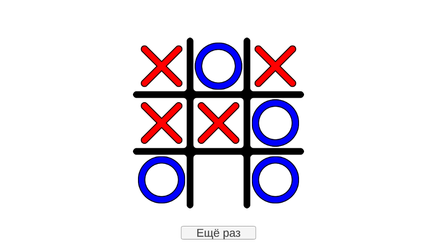

# Крестики-нолики

## Суть игры

Два игрока последовательно кликают на поле 3х3 из ячеек, выставляя на каждую ячейку свою фигуру - крестик (X) или
нолик (O). Первым ходит игрок X. Цель игры - выстроить три своих фигуры в линию - горизонтальную, вертикальную или
диагональную. После того, как это произойдет, линия будет перечеркнута, игроку будет начислено очко и будет показана
таблица результатов с предложением продолжить игру. Если игроки заполнят всё поле своими фигурами, но никакие из них не
образуют линию из трех ячеек, то в таком случае объявляется ничья - ни один игрок не получит очков.

## Дополнительный функционал

Счет игроков сохраняется между запусками игры. Есть возможность начать игру заново на любом этапе - в этом случае поле
будет очищено от фигур. Состояние поля сохраняется между запусками игры, кроме хода, завершающего игру.

# Перед запуском
В репозитории хранятся только ассеты проекта. Проект следует запускать с помощью Unity версии 2021.Х и выше. Основная сцена проекта - SampleScene.

Перед запуском игры в режиме Play необходимо скачать и установить пакедж TMPro.

**Может потребоваться обновление или исправление пакеджа Zenject.**

[Ссылка](https://github.com/modesttree/Zenject) на репозиторий.

[Ссылка](https://github.com/modesttree/Zenject/releases) на страницу с релизными пакеджами.

# Внутреннее устройство проекта

### Zenject

Регистрация скриптов происходит в [DependencyInstaller](./Assets/Scripts/injections/DependencyInstaller.cs).

### Game Manager

Скрипт [GameManager](./Assets/Scripts/general/GameManager.cs) является основным узлом бизнес-логики в проекте, и
инстанциируется через
[DependencyInstaller](./Assets/Scripts/injections/DependencyInstaller.cs) как синглтон. Скрипт наследуется от интерфейса
[IGameManager](./Assets/Scripts/general/IGameManager.cs), в котором реализованы следующие методы и поля:

#### Поля-события

* OnClick;
* OnGameEndCross;
* OnShowPanel;
* OnRestart;

#### Методы

* Restart;
* Touch;
* TrySelectCell;

#### Поля конкретной реализации интерфейса

    private Dictionary<int2, CellState> _cellStates = new(); - хранит в себе состояние ячеек поля (не выбрана, X или O) по координате
    private bool _turnO; - текущий ход игрока X или O
    private readonly Sprite _xImg; - Спрайт X
    private readonly Sprite _oImg; - Спрайт O
    private readonly WinConditionBase _winCheck; - Логика проверки условий победы
    private bool _lock; - общий блокировщик нажатия кнопок

    private WinState _winState; - текущее состояние игры
    private readonly IEndMsgProcessor _message; - Логика отображения сообщения о победе
    private readonly ISaveSys _saveSys; - Логика сохранений

В конструкторе класса подгружаются спрайты для выбранных клеток (_xImg и _oImg), через паттерн Command присваивается
логика [проверки условий победы](#Победа), [логика сообщения](#Логика-сообщений)
и [система сохранений](#Сохранение-прогресса). Все методы логики передаются через Zenject. После присваивания логики
выполняется

метод [TryRestoreField()](#TryRestoreField) для восстановления событий прошлой сессии.

#### TryRestoreField

Логика сохранений возвращает кортеж, содержащий состояние поля игры и текущего игрока. Данные приваиваются
соотвествующим полям.

#### TrySelectCell

Обработчик события нажатия на кнопку ячейки на поле, который вызывается в [ActionButton](#ActionButton).

Если поднят флаг блокировщика (_lock), срабатывает прерывание. Если поднят флаг окончания игры (_winState.GameFinished),
срабатывает прерывание. Далее производится проверка, была ли кнопка уже нажата - занята ли клетка. Если да - прерывание.

Если прерывания не сработало, то состоянию ячейки на поле присваевается состояние, полученное из метода
CellStateByPlayer. Вызывается событие OnClick, в которое передается кортеж из спрайта и его цвета через метод GetClrImg,
а так же координата ячейки.

Далее производится проверка условий победы
через [WinConditionBase.Handle()](./Assets/Scripts/general/win/condition/WinConditionBase.cs) (
см. [Логика победы](#Логика-победы)), куда передаются

* текущее состояние ячейки;
* координаты;
* ячейки, отмеченные текущим игроком
* количество заполненых на данный момент ячеек
* закончена ли игра.

Если состояние игры

    _winState.GameFinished == true;

то срабатывает событие OnGameEndCross, куда передается [тип линии](#Зачеркивание-результата), начальная координата для
построения, и хэндлер [EndGameLogic](#EndGameLogic) в случае, если не было ничьей. В противном случае вместо события
OnGameEndCross вызвается просто EndGameLogic; Выполнение кода прерывается.

Если игра ещё не окончена, то ход передается другому игроку и состояние поля сохраняется через _saveSys.SaveFieldState.
Сохранение поля после проверки на окончание гры сделано для того, чтобы после перезапуска игры ни один игрок не получал
очки автоматически.

#### EndGameLogic

Этот хэндлер должен срабатывать при начале и окончании анимации перечеркивания выигрышного результата. Пока анимация
работает, нельзя нажать на какую-либо кнопка на сцене. После окончания анимации _saveSys.SaveScore записывает состояние
выигрыша (X, O или ничья). Срабатывает событие вызова [панели](#Панель-счета) OnShowPanel.

#### CellStateByPlayer

Возвращает X, если передается значение false и O если true.

#### Restart

Обработчик события нажатия на кнопку [перезапуска игры](#RestartButton).

Прерывается, если включен блокировщик нажатия. Вызывает событие OnRestart. Возвращает все значения к исходным,
перезаписывает состояние поля как очищенное.

#### Touch

Вызывается при инициализации кнопки ячейки для обновления отображения при перезапуске игровой сессии. Если все ячейки
пусты, прерывается. Если в находит переданную координату в поле ячеек, вызывает событие OnClick, в которое передается
кортеж из спрайта и его цвета через метод GetClrImg, а так же координата ячейки.

# Сохранение прогресса

Сохранение происходит в файле [SaveSys](./Assets/Scripts/general/save/SaveSys.cs), который наследуется от
интерфейса [ISaveSys](./Assets/Scripts/general/save/ISaveSys.cs). Конкретная реализация задается
через [Zenject](#zenject). Все ячейки сохранения прописаны через класс PlayerPrefs.

### Методы сохраенения

#### GetFieldState

Возвращает кортеж из словаря с состоянием ячеек, где ключем являются их координаты, и текущий ход игрока.

* Проверяет наличие ячейки сохранения "Cell_State". В случае отсутствия возвращает пустой кортеж;
* Далее преобразует считанную JSON-строку в промежуточную обертку FieldState;
* Преобразует последовательность из элементов field в словарь и возвращает кортеж.

#### SaveFieldState

Создает обертку FieldState с переданными параметрами словаря и хода игрока и сохраняет её в виде строки JSON в ячейку "
Cell_State".

#### GetScore

Проверяет наличие ячейки сохранения "Player_Score", и в случае наличия преобразует JSON-строку в обертку Pair<int, int>,
где переменная **a** - счет первого игрока, **b** - второго. В случае отсутствия ячейки возвращает пустую обёрстку с
нулевыми значениями.

#### SaveScore

Сохраняет ткущий счет, увеличивая или не увеличивая его в зависимости от условий окончания игры.

* Берется текущий счет через GetScore;
* Через условия определяется, будет ли начислен счет, и если да - то кому из игроков;
* Создается новая обертка Pair<int, int> с новым счетом;
* Обертка записывается в виде JSON-строки в ячейку сохранения "Player_Score"

# Победа

## WinConditionBase

Является [базовым классом для проверки условий победы](./Assets/Scripts/general/win/condition/WinConditionBase.cs) через
паттерн Chain of Responsibility.

    public WinConditionBase SetNext(WinConditionBase handler) - задает следующего исполнителя
      public virtual WinState Handle(CellState state, int2 coord, Func<int2, bool> cont, int cellCount,
            bool gameFinished) - проводит проверку. Переопределяется в каждом последующем наследнике класса.

Изначально возвращает значение, которое определяется так, что игра не завершена.

### Одиночные классы условий

Каждый проводит проверку на свое условие через инструмент [WinChecker](./Assets/Scripts/utilities/WinChecker.cs):

* WinConditionHor - ячейки заполнены гризонтально;
* WinConditionVert - вертикильно;
* WinConditionInvDiag - диагонально слева-направо;
* WinConditionInvDiag - диагонально справа-налево.

### Композиты

* WinConditionFast - собирает в себя провеки по направлениям;
* WinConditionMain - использует композит для проверки состояния, пока не все клетки заполнены;
* WinConditionTie - ничья, срабатывает если все ячейки заполнены, а игра не завершена.

### Фабрики

* WinCheckBase - базовый класс фабрики. Наследуется
  от [WinConditionBase](./Assets/Scripts/general/win/condition/WinConditionBase.cs);
* WinCheckOne - реализация фабрики. Задается через Zenject как одиночный инстанс.

## Принцип работы

[GameManager](#game-manager) передает в метод Handle следующие параметры:

### CellState state

Состояние ячейки передается либо X, либо O.

### int2 coord

Координаты ячейки

### Func<int2, bool> cont

Делегат, который проверяет, соответствует ли хотя бы один набор координат
из [одиночных классов условий](#Одиночные-классы-условий) координатам ячеек, которые были отмечены игроком, переданным
через CellState state.

### int cellCount

Количество ячеек, которое отмечено в данный момент. Используется для определения состояния ничьей.

### bool gameFinished

Флаг окончания игры. Поднимается если хотя бы одно из условий выполнено.

## Результат игры

Возвращается через структуру [WinState](./Assets/Scripts/general/win/WinState.cs). Структура содержит в себе:

* public CellState CellState - победитель. Если такового нет - возвращает None;
* int2 Coord - координата последней выбранной ячейки. Нужна для отрисовки [линии](#Зачеркивание-результата);
* public CrossLineType Line - тип [линии](#Зачеркивание-результата) - горизонтальная, вертикальная, диагональная;
* public bool GameFinished - флаг окончания игры.

# Сцена

На сцене отображается поле игры с кнопками ячеек, [кнопки перезапуска игры](#Кнопка-перезапуска) и панель с
результатами. Поле представляет собой GameObject с компонентом Grid Layout Group. В нем расположены
9 [кнопок](#Кнопка-ячейки). Кнопки сохранены в виде префаба для упрощения дальнейшего переиспользования. Поверх поля
кнопок расположен Image с очертанием границ, в котором
находится [линия перечеркивания победной комбинации](#Зачеркивание-результата) . На самом верху иерархии
находится [панель результатов](#Панель-результатов).

## Кнопка ячейки

### ActionButton

Кнопка ячейки представляет собой стандартный GameObject с компонентами Button и Image, а так же
скриптом [ActionButton](./Assets/Scripts/ui/button/ActionButton.cs). Скрипт содержит ссылки
на [GameManager](#game-manager) и отображение [BtnViewer](#Отображение-btnviewer), составляя собой MVC, где модель
находится в GameManager, отображение в BtnViewer, а контроллером является ActiuonButton. Менеджер и отображение
передаются через Zenject во время инициализации кнопки. Так же есть сериализованное поле int2 coord для хранения
координат кнопки.

#### Construct

* Присваиваются значения переменных менеджера и отображения, а так же компонента Button;
* Инициализируется отображение, через _viewer.Init(transform, coord);
* Происходит подписка отображения к событиям менеджера OnRestart и OnClick;
* Делегат менеджера TrySelectCell передается в событие кнопки onClick;
* Вызывается проверка состояния отображения кнопки, если ячейка была выбрана в предыдущей игровой сессии.

#### SetCoord

Утилита, автоматически присваивающая координаты кнопке, в зависимости от её очередности в сетке. Вызывается из
контекстного меню редактора.

#### OnDestroy

Отписка от событий при уничтожении объекта.

### Отображение BtnViewer

Содержи в себе координаты и ссылку на компонент Image, меняет отображение ячейки в зависимости от происхлодящих событий.

#### Init

Инициализация объекта.

* Создает новый GameObject с именем "ViewImage";
* Присваивает ему в качестве парента передаваемый трансформ - это transform - компонент ActionButton, а так же
  выравнивает позицию и размер объекта;
* Добавляет к объекту компонент Image;
* Отключает у Image обнаружение через RayCast при нажатии и задает цвет изображения прозрачным.

#### Update

Обновляет цвет и спрайт картинки в соответствии с переданными параметрами кортежа. Выполняется при срабатывании события
OnClick в [GameManager](#game-manager). Если компонена Image нету, или если переданные координаты не соответствуют
сохраненным при инициализации, то выполнение прерывается.

#### Refresh

Частный случай метода Update. Удаляет спрайт из компонента Image и делает его прозрачным. Выполняется при срабатывании
события OnRestart в [GameManager](#game-manager).

### Кнопка перезапуска

[RestartButton](./Assets/Scripts/ui/button/Panel.cs) При инициализации вносит в делегат кнопки метод Restart
из [GameManager](#game-manager), который передается в конструктор через Zenject

### Зачеркивание результата

Если один из игроков выстраивает в ряд три своих фигуры, игра завершается и
начинается [анимация зачеркивания линией](./Assets/Scripts/ui/Line.cs) этих фигур.

#### Construct

* В локальную переменную записываются точка начала координат (_rtf), изображение линии (_img) и точка вращения линии (_
  imgRtf);
* Присваивается ссылка на [GameManager](#game-manager);
* Происходит подписка на события OnGameEndCross и OnRestart;
* Изображение скрывается

#### Enable

Меняет цвет изображения с белого на прозрачный и наоборот в зависимости от флага

#### Hide

Частный случай метода Enable, который скрывает изображение

#### Cross

Определяет параметры для анимации и запускает её. В качестве параметров определяется положение точки начала координат,
поворот точки вращения и целевая длина линии. Параметры определяются относительно переданного типа линии и начальных
координат. При запуске анимации так же передается делегат для блокировки нажатия кнопок.

#### Extend

Метод включает отображение линии и запускает корутин анимации Extend_C, куда передается целевая длина линии и делегат
для блокировки нажатия кнопок.

#### Extend_C

Анимирует перечеркивание линией ячеек. Каждый тик изображение линии увеличивается от начального значения в 20 до
целевого, переданного параметрами. В начале вызывается делегат блокировки кнопок с параметром True, после окончания
делегат вызывается с параметром False.

#### OnDestroy

Отписка от событий при уничтожении объекта.

### Панель результатов

Панель результатов состоит из совокупности UI - объектов с общим иерархическим предком - панельсю со
скриптом [EndgamePanel](./Assets/Scripts/ui/EndgamePanel.cs).

#### Construct

* Присваивается ссылка на [GameManager](#game-manager);
* Происходит подписка на события OnShowPanel и OnRestart;
* Присваивается CanvasGroup для скрытия/отображения панели;
* Присваиваются переменные TMP_Text со счетом каждого игрока и текстом заголовка.

#### HidePanel

Скрывает панель, переводя Alpha у CanvasGroup в 0, а так же отключая блокировку райкаста и цель райкаста.

#### ShowPanel

* Показывает панель переводя Alpha у CanvasGroup в 1, а так же включая блокировку райкаста и цель райкаста;
* Присваивает полям TMP_Text их новые значения переданные в параметрах.

#### OnDestroy

Отписка от событий при уничтожении объекта.

# Сопутствующие скрипты

### CellState

Отображает три состояния ячейки и, в последствии, выигрыша.

### CrossLineType

Типы линий в зависимости от комбинации ячеек:

* None - значение по-умолчанию;
* Hor - горизонтальная линия;
* Vert - вертикальная;
* Diag - Диагональная, начинающаяся сверху слева и заканчивающаяся внизу справа;
* InvDiag - Диагональная, начинающаяся сверху справа и заканчивающаяся внизу слева.
### Pair<T1, T2> 
Обертка для сериализации пар значений.
### WrapArray<T>
Обертка для сериализации массивов данных.
### FieldState
Обертка для сохранения состояния поля и хода игрока.
### utilities namespace
Различные полезные инструменты, которые писались и дополнялись по мере разработки разных проектов.